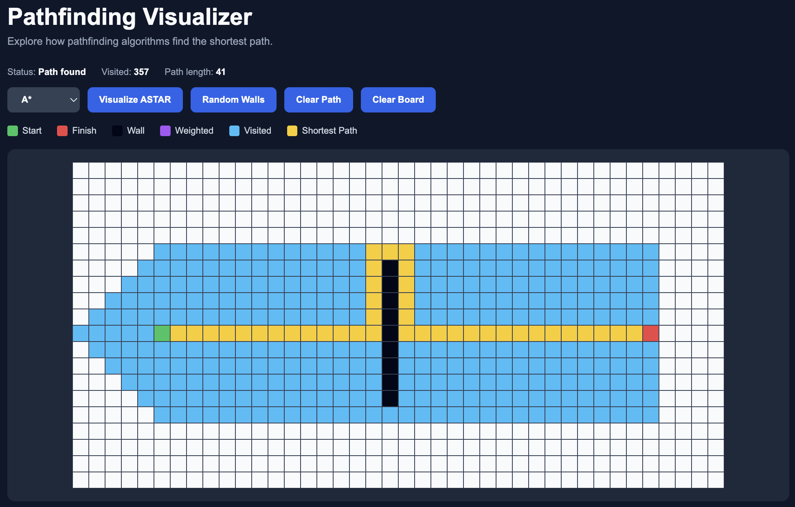

# Pathfinding Visualizer

An interactive pathfinding algorithm visualizer built with **React** and **TypeScript**. The application demonstrates how different pathfinding algorithms explore a grid and determine an optimal path between a start and finish node.

An interactive pathfinding algorithm visualizer built with React and TypeScript...

## Demo



## Features

- Visualize **Breadth-First Search (BFS)**
- Visualize **Dijkstra's Algorithm**
- Visualize **A\* Search**
- Animated node exploration
- Shortest-path visualization
- Create and remove walls interactively
- Add weighted nodes to simulate higher traversal costs
- Generate random walls
- Clear the current path or reset the entire board
- Live visited-node counter
- Path length displayed after completion
- Status indicator for algorithm execution
- Controls are locked during visualization to prevent conflicting animations

## Algorithms

### Breadth-First Search

BFS explores nodes level by level. On an unweighted grid, it guarantees a shortest path based on the number of steps.

BFS does not take weighted nodes into account.

### Dijkstra's Algorithm

Dijkstra's algorithm finds a minimum-cost path by always exploring the node with the lowest known distance from the start.

Unlike BFS, weighted nodes affect the path selected by Dijkstra.

### A* Search

A* combines the cost of reaching a node with an estimate of the remaining distance to the destination.

This project uses **Manhattan distance** as the heuristic:

`|currentRow - finishRow| + |currentCol - finishCol|`

A* also takes weighted nodes into account.

## Grid Controls

| Action | Result |
| --- | --- |
| Left click | Add or remove a wall |
| Right click | Add or remove a weighted node |
| Visualize | Run the selected algorithm |
| Random Walls | Generate a random wall configuration |
| Clear Path | Remove the visualization while preserving the board |
| Clear Board | Reset the entire grid |

## Legend

- **Green** — Start node
- **Red** — Finish node
- **Black** — Wall
- **Purple** — Weighted node
- **Blue** — Visited node
- **Yellow** — Shortest path

Weighted nodes have a traversal cost of **5**, while regular nodes have a traversal cost of **1**.

## Technologies

- React
- TypeScript
- Vite
- CSS
- Git / GitHub

## Running Locally

Clone the repository:

```bash
git clone https://github.com/ElyesJallouli/pathfinding-visualizer.git
```

Move into the project:

```bash
cd pathfinding-visualizer
```

Install the dependencies:

```bash
npm install
```

Start the development server:

```bash
npm run dev
```

Then open the local address displayed by Vite in your browser.

## What I Learned

This project helped me practice:

- Implementing graph-search and pathfinding algorithms
- Comparing weighted and unweighted pathfinding
- Reconstructing shortest paths
- React state management
- TypeScript interfaces and component props
- Creating animated algorithm visualizations
- Building interactive grid-based user interfaces

## Future Improvements

Possible future additions include:

- Drag-and-drop start and finish nodes
- Additional maze-generation algorithms
- Adjustable visualization speed
- Additional pathfinding algorithms
- Improved mobile responsiveness

## Author

**Elyes Jallouli**

Software Engineering student at Concordia University